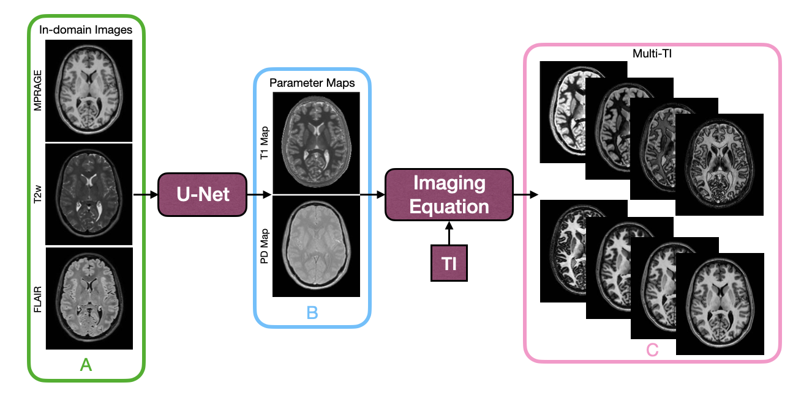

# 📌 Synthetic Multi-Inversion Time MR Contrasts (SyMTIC)


## 🚀 Getting Started

This is the Github page assoicated with the paper "Synthetic multi-inversion time magnetic resonance images for visualization of subcortical structures".
We provide inference code and pretrained weights for running SyMTIC.
If harmonization or imputation is required for out-of-distribution datasets, we recommend using [HACA3](https://github.com/shays15/haca3) as shown in the paper.

Model weights can be downloaded [here](https://livejohnshopkins-my.sharepoint.com/:u:/g/personal/shays6_jh_edu/IQBIE87UIDmkTo3E_Dr6CC6mAVupjSDrLZVfgNCZWaXPS0o?e=1ChdsT).

Paper links: [arXiv](https://arxiv.org/pdf/2506.04173) & [SPIE Digital Library](https://doi.org/10.1117/1.JMI.13.1.014002)

### 🧠 Prerequisites
- Python 3.10
- PyTorch ≥ 1.13
- See `requirements.txt` for full package versions

```bash
git clone https://github.com/shays15/symtic.git
cd symtic
pip install -r requirements.txt
```
## 🔍 Testing

To generate a multi-TI images:

```bash
python test.py \
  --t1 PATH_TO_INPUT_T1 \
  --t2 PATH_TO_INPUT_T2 \
  --flair PATH_TO_INPUT_FLAIR \
  --ti DESIRED_TI_VALUE \
  --o OUTPUT_DIRECTORY \
  --model PATH_TO_SAVED_MODEL \ 
  --gpu GPU_ID
```

---

## 🧠 Citation

Savannah P. Hays, Lianrui Zuo, Anqi Feng, Yihao Liu, Blake E. Dewey, Jiachen Zhuo, Ellen M. Mowry, Scott D. Newsome, Jerry L. Prince, Aaron Carass, Synthetic multi-inversion time magnetic resonance images for visualization of subcortical structures, *J. Med. Imag.* **13**(1), 014002 (2026), doi: 10.1117/1.JMI.13.1.014002.

---

## 🙏 Acknowledgments

This work was partially supported by the **National Science Foundation Graduate Research
Fellowship** (Grant No. DGE-2139757 [S. P. Hays]) and **National Cancer Institute (NCI)** (Grant Nos.
R01 CA253923 [L. Zuo] and R01 CA275015 [L. Zuo]). It was also supported by the **PCORI** (Grant
No. MS-1610-37115 [PIs: S. D. Newsome and E. M. Mowry]). The statements in this publication
are solely the responsibility of the authors and do not necessarily represent the views of PCORI,
its Board of Governors, or Methodology Committee.
